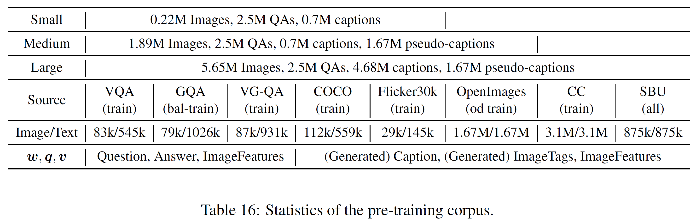

# Download

## Pre-trained Models
The pretrained X152-C4 object-attribute detection can be downloaded [here](https://penzhanwu2.blob.core.windows.net/sgg/sgg_benchmark/vinvl_model_zoo/vinvl_vg_x152c4.pth).
The associated labelmap can be downloaded [here](https://penzhanwu2.blob.core.windows.net/sgg/sgg_benchmark/vinvl_model_zoo/VG-SGG-dicts-vgoi6-clipped.json).
With code from our [Scene Graph Benchmark Repo](https://github.com/microsoft/scene_graph_benchmark), one can extract features with following command:
```bash
# pretrained models at https://penzhanwu2.blob.core.windows.net/sgg/sgg_benchmark/vinvl_model_zoo/vinvl_vg_x152c4.pth
# the associated labelmap at https://penzhanwu2.blob.core.windows.net/sgg/sgg_benchmark/vinvl_model_zoo/VG-SGG-dicts-vgoi6-clipped.json
python tools/test_sg_net.py --config-file sgg_configs/vgattr/vinvl_x152c4.yaml TEST.IMS_PER_BATCH 2 MODEL.WEIGHT models/vinvl/vinvl_vg_x152c4.pth MODEL.ROI_HEADS.NMS_FILTER 1 MODEL.ROI_HEADS.SCORE_THRESH 0.2 DATA_DIR "../maskrcnn-benchmark-1/datasets1" TEST.IGNORE_BOX_REGRESSION True MODEL.ATTRIBUTE_ON True TEST.OUTPUT_FEATURE True
```
The output feature will be encoded as base64. 

One can also visualize the detections from the pretrained model with code from our [Scene Graph Benchmark Repo](https://github.com/microsoft/scene_graph_benchmark).
```bash
# visualize VinVL object detection
# pretrained models at https://penzhanwu2.blob.core.windows.net/sgg/sgg_benchmark/vinvl_model_zoo/vinvl_vg_x152c4.pth
# the associated labelmap at https://penzhanwu2.blob.core.windows.net/sgg/sgg_benchmark/vinvl_model_zoo/VG-SGG-dicts-vgoi6-clipped.json
python tools/demo/demo_image.py --config_file sgg_configs/vgattr/vinvl_x152c4.yaml --img_file ../maskrcnn-benchmark-1/datasets1/imgs/woman_fish.jpg --save_file output/woman_fish_x152c4.obj.jpg MODEL.WEIGHT models/vinvl/vinvl_vg_x152c4.pth MODEL.ROI_HEADS.NMS_FILTER 1 MODEL.ROI_HEADS.SCORE_THRESH 0.2 DATA_DIR "../maskrcnn-benchmark-1/datasets1" TEST.IGNORE_BOX_REGRESSION False

# visualize VinVL object-attribute detection
# pretrained models at https://penzhanwu2.blob.core.windows.net/sgg/sgg_benchmark/vinvl_model_zoo/vinvl_vg_x152c4.pth
# the associated labelmap at https://penzhanwu2.blob.core.windows.net/sgg/sgg_benchmark/vinvl_model_zoo/VG-SGG-dicts-vgoi6-clipped.json
python tools/demo/demo_image.py --config_file sgg_configs/vgattr/vinvl_x152c4.yaml --img_file ../maskrcnn-benchmark-1/datasets1/imgs/woman_fish.jpg --save_file output/woman_fish_x152c4.attr.jpg --visualize_attr MODEL.WEIGHT models/vinvl/vinvl_vg_x152c4.pth MODEL.ROI_HEADS.NMS_FILTER 1 MODEL.ROI_HEADS.SCORE_THRESH 0.2 DATA_DIR "../maskrcnn-benchmark-1/datasets1" TEST.IGNORE_BOX_REGRESSION False
```


We also provide the X152-C4 objecte detection [config file](https://biglmdiag.blob.core.windows.net/vinvl/model_ckpts/od_models/FourSets/config.yaml) and [pretrained model](https://biglmdiag.blob.core.windows.net/vinvl/model_ckpts/od_models/FourSets/model_final.pth) on the merged four datasets (COCO with stuff, Visual Genome, Objects365 and Open Images). 
The labelmap to decode the 1848 can be found [here](https://biglmdiag.blob.core.windows.net/vinvl/model_ckpts/od_models/FourSets/vgcocooiobjects_v1_class2ind.json). The first 1594 classes are exactly VG classes, with the same order. 
The map from COCO vocabulary to this merged vocabulary can be found [here](https://biglmdiag.blob.core.windows.net/vinvl/model_ckpts/od_models/FourSets/coco_vgoiv6_class2ind.json).
The map from Objects365 vocabulary to this merged vocabulary can be found [here](https://biglmdiag.blob.core.windows.net/vinvl/model_ckpts/od_models/FourSets/object365_vgoiv6_class2ind.json).
The map from OpenImages V5 vocabulary to this merged vocabulary can be found [here](https://biglmdiag.blob.core.windows.net/vinvl/model_ckpts/od_models/FourSets/oi_vgoiv6_class2ind.json).

In addition, we provide a X152-C4 objecte detection [config file](https://biglmdiag.blob.core.windows.net/vinvl/model_ckpts/od_models/objects365/attr_frcnn_X152C4.yaml) and [pretrained model](https://biglmdiag.blob.core.windows.net/vinvl/model_ckpts/od_models/objects365/model_0740000.pth) on Objects365. Its labelmap to decode the object classes can be found [here](https://biglmdiag.blob.core.windows.net/vinvl/model_ckpts/od_models/objects365/train.labelmap.tsv).

## Pre-exacted Image Features
For ease-of-use, we make pretrained features and predictions available for all pretraining datasets and downstream tasks. 
Features are stored in tsv (tab-separated-values) format that can be used in [pretraining](oscar/datasets/oscar_tsv.py) and dowstream tasks like [COCO Image-Text Retrieval](oscar/run_retrieval.py).

Notice that all the links below are links to a folder. We recommend using the following AzCopy command to download.
```
path/to/azcopy copy <folder-link> <target-address> --resursive"
```

[COCO 2014 Train/Val Image Features (~50G)](https://biglmdiag.blob.core.windows.net/vinvl/image_features/coco_X152C4_frcnnbig2_exp168model_0060000model.roi_heads.nm_filter_2_model.roi_heads.score_thresh_0.2/model_0060000/)

[COCO 2014 Test Image Features (~16G)](https://biglmdiag.blob.core.windows.net/vinvl/image_features/coco_X152C4_frcnnbig2_exp168model_0060000model.roi_heads.nm_filter_2_model.roi_heads.score_thresh_0.2/model_0060000/coco2014test/)

[COCO 2015 Test Image Features (~32G)](https://biglmdiag.blob.core.windows.net/vinvl/image_features/coco_X152C4_frcnnbig2_exp168model_0060000model.roi_heads.nm_filter_2_model.roi_heads.score_thresh_0.2/model_0060000/coco2015test/)

[GQA All Image Features (~62G)](https://biglmdiag.blob.core.windows.net/vinvl/image_features/gqa_X152C4_frcnnbig2_exp168model_0060000model.roi_heads.nm_filter_2_model.roi_heads.score_thresh_0.2/model_0060000/)

[NVLR2 Train/Del/Test Image Features (~28G)](https://biglmdiag.blob.core.windows.net/vinvl/image_features/nlvr2_X152C4_frcnnbig2_exp168model_0060000model.roi_heads.nm_filter_2_model.roi_heads.score_thresh_0.2/)

[Flickr30k All Image Features (~14G)](https://biglmdiag.blob.core.windows.net/vinvl/image_features/flickr30k_X152C4_frcnnbig2_exp168model_0060000model.roi_heads.nm_filter_2_model.roi_heads.score_thresh_0.2/model_0060000/)

[Google Conceptual Captions Image Features (Huge, ~960G, splitted into 12 chunks)](https://biglmdiag.blob.core.windows.net/vinvl/image_features/googlecc_X152C4_frcnnbig2_exp168model_0060000model.roi_heads.nm_filter_2_model.roi_heads.score_thresh_0.2/)

[SBU Image Features (Huge, ~280G, splitted into 4 chunks)](https://biglmdiag.blob.core.windows.net/vinvl/image_features/sbu_X152C4_frcnnbig2_exp168model_0060000model.roi_heads.nm_filter_2_model.roi_heads.score_thresh_0.2/model_0060000/)

[Open Images Detection Image Features (Huge, ~530G, splitted into 8 chunks)](https://biglmdiag.blob.core.windows.net/vinvl/image_features/oi_X152C4_frcnnbig2_exp168model_0060000model.roi_heads.nm_filter_2_model.roi_heads.score_thresh_0.2/model_0060000/)


### Oscar+ pretraining corpus
 

[Small corpus](https://biglmdiag.blob.core.windows.net/vinvl/pretrain_corpus/coco_flickr30k_gqa.tsv)

[Medium corpus](https://biglmdiag.blob.core.windows.net/vinvl/pretrain_corpus/coco_flickr30k_gqa_oi.tsv)

[Large corpus](https://biglmdiag.blob.core.windows.net/vinvl/pretrain_corpus/coco_flickr30k_googlecc_gqa_sbu_oi.tsv)

We have tried our best to make sure that there is no data contamination between pretraining corpus and test sets for downstream tasks. 
More specifically, we use two methods to achieve this. 
(1) We use the COCO Image ID of Visual Genome and Flickr30k images.
(2) For COCO, Visual Genome and Flickr30k, we calucate the pair-wise l2 norm between two images after resizing them into the same size.


## Oscar+ pretrained models and downstream tasks models
The code to produce all vision-language results (both pretraining and downstream task finetuning) can be found in our [OSCAR repo](https://github.com/microsoft/Oscar).
One can find the model zoo for vision-language tasks [here](https://github.com/microsoft/Oscar/blob/master/MODEL_ZOO.md).


### Note
It is recommended to download large files with **AzCopy** for faster speed.
AzCopy executable tools can be downloaded [here](https://docs.microsoft.com/en-us/azure/storage/common/storage-use-azcopy-v10#download-azcopy).
Decompress the tar file and put the executable in any path. To download from
any URL above, the command is:
```bash
path/to/azcopy copy <URL> <local_path>

# for example, downloading coco pre-extracted features and predictions
path/to/azcopy copy https://biglmdiag.blob.core.windows.net/vinvl/image_features/coco_X152C4_frcnnbig2_exp168model_0060000model.roi_heads.nm_filter_2_model.roi_heads.score_thresh_0.2/model_0060000/ <local_path> --recursive
```

