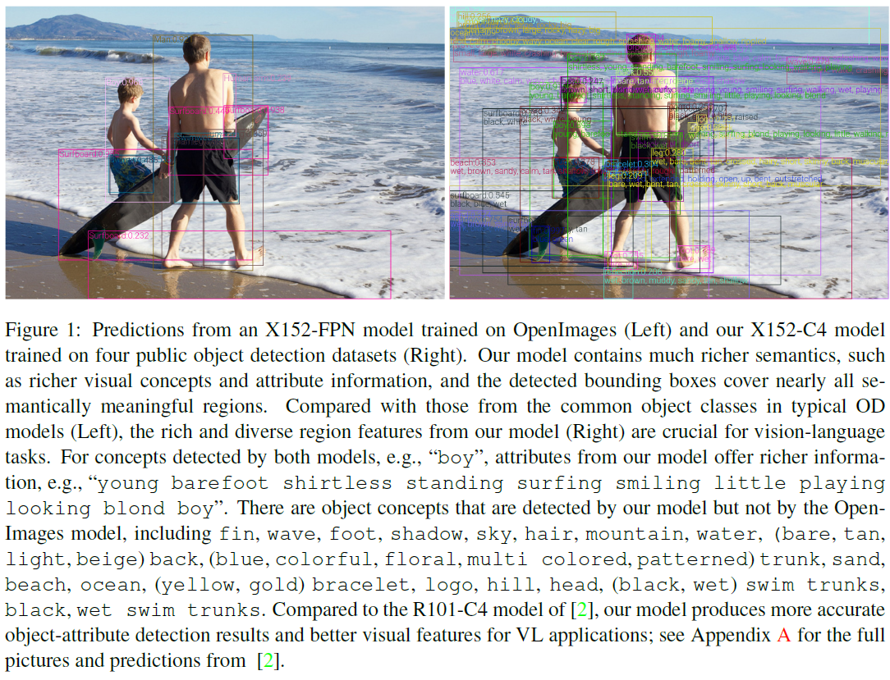

# VinVL: Making Visual Representations Matter in Vision-Language Models  
## Updates
02/28/2021: Project page built. <br/>

## Introduction
This repository is the project page for [VinVL](https://arxiv.org/abs/2101.00529), containing necessary instructions to reproduce the results presented in the paper.
We presents a detailed study of improving visual representations for vision language (VL) tasks and develops an improved object detection model to provide object-centric representations of images. 
Compared to the most widely used [bottom-up and top-down model](https://arxiv.org/abs/1707.07998) ([code](https://github.com/peteanderson80/bottom-up-attention)), the new model is bigger, better-designed for VL tasks, and pre-trained on much larger training corpora that combine multiple public annotated object detection datasets. 
Therefore, it can generate representations of a richer collection of visual objects and concepts. While previous VL research focuses mainly on improving the vision-language fusion model and leaves the object detection model improvement untouched, we show that visual features matter significantly in VL models.
In our experiments we feed the visual features generated by the new object detection model into a Transformer-based VL fusion model [OSCAR](https://arxiv.org/abs/2004.06165) ([code](https://github.com/microsoft/Oscar)), and utilize an improved approach to pre-train the VL model and fine-tune it on a wide range of downstream VL tasks. 
Our results show that the new visual features significantly improve the performance across all VL tasks, creating new state-of-the-art results on seven public benchmarks.

 

## Performance
Task    | t2i | t2i | i2t | i2t | IC  | IC  |  IC  |  IC  | NoCaps | NoCaps |   VQA    |  NLVR2  |   GQA   |
--------|-----|-----|-----|-----|-----|-----|------|------|--------|--------|----------|---------|---------|
Metric	| R@1 | R@5 | R@1 | R@5 | B@4 |  M  |  C   |   S  |    C   |    S   | test-std | test-P  | test-std|
SoTA_S  |39.2 | 68.0|56.6 | 84.5|38.9 |29.2 |129.8 | 22.4 |   61.5 |  9.2   |  70.92   | 58.80   | 63.17   |
SoTA_B  |54.0 | 80.8|70.0 | 91.1|40.5 |29.7 |137.6 | 22.8 |   86.58| 12.38  |  73.67   | 79.30   | 61.62   |
SoTA_L  |57.5 | 82.8|73.5 | 92.2|41.7 |30.6 |140.0 | 24.5 |     -  |   -    |  74.93   | 81.47   |   -     |
-----   |---  |---  |---  |---  |---  |---  |---   |---   |---     |---     |---       |---      |---      |
VinVL_B |58.1 | 83.2|74.6 | 92.6|40.9 |39.9 |140.6 | 25.1 |   92.46| 13.07  |  76.12   | 83.08   | 64.65   |
VinVL_L |58.8 | 83.5|75.4 | 92.9|41.0 |31.1 |140.9 | 25.2 |     -  |   -    |  76.62   | 83.98   |   -     |
gain    | 1.3 |  0.7| 1.9 |  0.6| -0.7| 0.5 | 0.9  | 0.7  |    5.9 |  0.7   |   1.69   |  2.51   |  1.48   |

t2i: text-to-image retrieval; i2t: image-to-text retrieval; IC: image captioning on COCO. 

## Leaderboard results
VinVL has achieved top-position in several VL leaderboards, including [Visual Question Answering (VQA)](https://competitions.codalab.org/competitions/3221#results), [Microsoft COOC Image Captioning](https://eval.ai/web/challenges/challenge-page/514/leaderboard/1386), [Novel Object Captioning (nocaps)](https://eval.ai/web/challenges/challenge-page/355/leaderboard/1011), and [Visual Commonsense Reasoning (VCR)](https://leaderboard.allenai.org/vcr/submissions/public).

## Comparison with image features from [bottom-up and top-down model](https://arxiv.org/abs/1707.07998) ([code](https://github.com/peteanderson80/bottom-up-attention)).
 

## Source code
### Pretrained Faster-RCNN model and feature extraction
The pretrained X152-C4 object-attribute detection can be doanloaded [here](https://penzhanwu2.blob.core.windows.net/results/vinvl/od_models/vinvl_vg_x152c4.pth).
With code from our [Scene Graph Benchmark Repo](https://github.com/microsoft/scene_graph_benchmark), one can extract features with following command:
```bash
python tools/test_sg_net.py --config-file sgg_configs/vgattr/vinvl_x152c4.yaml TEST.IMS_PER_BATCH 2 MODEL.WEIGHT models/vinvl/vinvl_vg_x152c4.pth MODEL.ROI_HEADS.NMS_FILTER 1 MODEL.ROI_HEADS.SCORE_THRESH 0.2 DATA_DIR "../maskrcnn-benchmark-1/datasets1" TEST.IGNORE_BOX_REGRESSION True MODEL.ATTRIBUTE_ON True
```
The output feature will be encoded as base64. 

### Pretraind Oscar+ models and VL downstream tasks
The code to produce all vision-language results (both pretraining and downstream task finetuning) can be found in our [OSCAR repo](https://github.com/microsoft/Oscar).
One can find the model zoo for vision-language tasks [here](https://github.com/microsoft/Oscar/blob/master/MODEL_ZOO.md).

## Citations
Please consider citing this paper if you use the code:
```
@article{li2020oscar,
  title={Oscar: Object-Semantics Aligned Pre-training for Vision-Language Tasks},
  author={Li, Xiujun and Yin, Xi and Li, Chunyuan and Hu, Xiaowei and Zhang, Pengchuan and Zhang, Lei and Wang, Lijuan and Hu, Houdong and Dong, Li and Wei, Furu and Choi, Yejin and Gao, Jianfeng},
  journal={arXiv preprint arXiv:2004.06165},
  year={2020}
}

@article{zhang2021vinvl,
  title={VinVL: Making Visual Representations Matter in Vision-Language Models},
  author={Zhang, Pengchuan and Li, Xiujun and Hu, Xiaowei and Yang, Jianwei and Zhang, Lei and Wang, Lijuan and Choi, Yejin and Gao, Jianfeng},
  journal={arXiv preprint arXiv:2101.00529},
  year={2021}
}
```

## License
Oscar is released under the MIT license. See [LICENSE](LICENSE) for details. 

